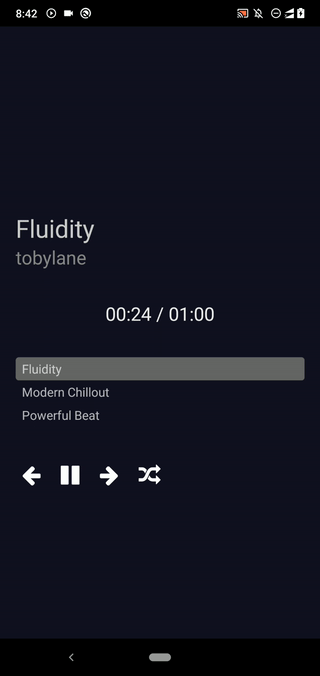

# react-native-track-player-demo
A music track player app with a pre-defined playlist

## Preview



## How to run the app?

- Download or clone the repository.
- Install dependencies:
```bash
npm install
# --- or ---
yarn install
```
- Run the app:
```bash
npx react-native run-android
# --- or ---
npx react-native run-ios
```

## Credits

Contains three royalty free music tracks from [Pixabay](https://pixabay.com/music/). Credit goes to original music track authors (Filenames contain Pixabay track identifiers).

## License

[MIT](LICENSE)
